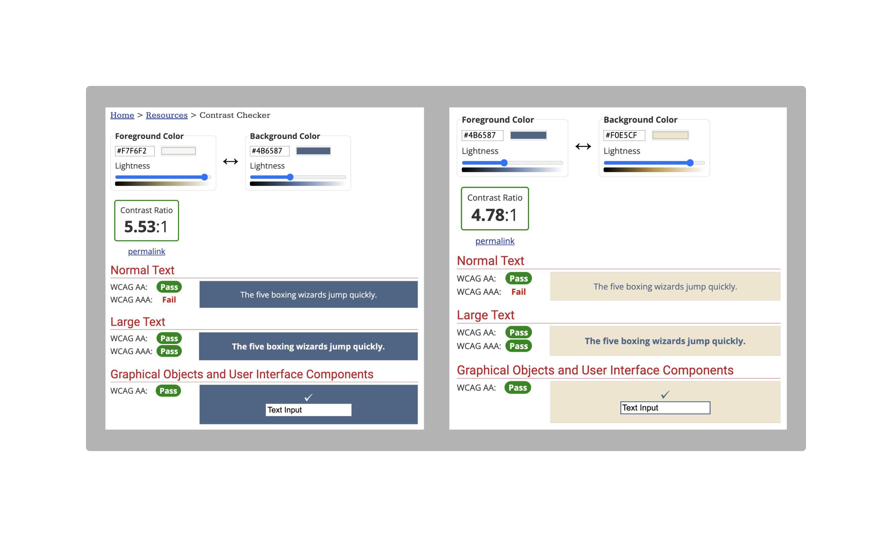
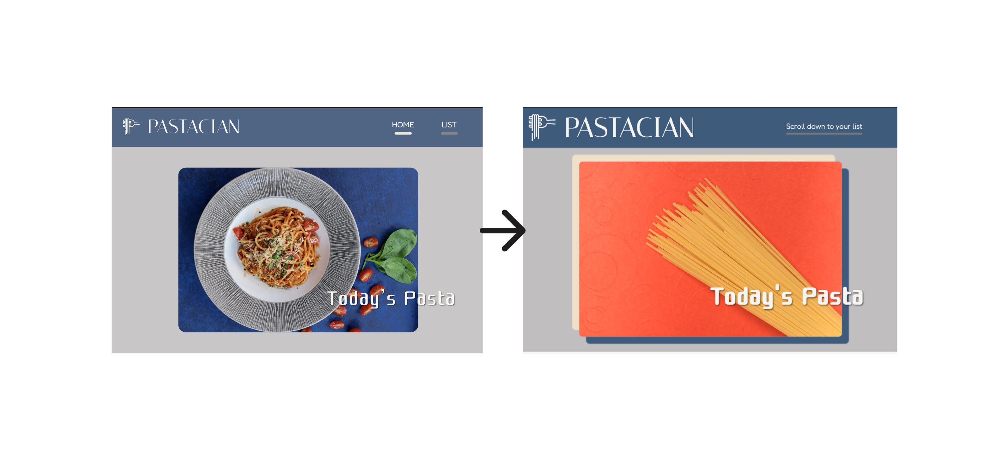
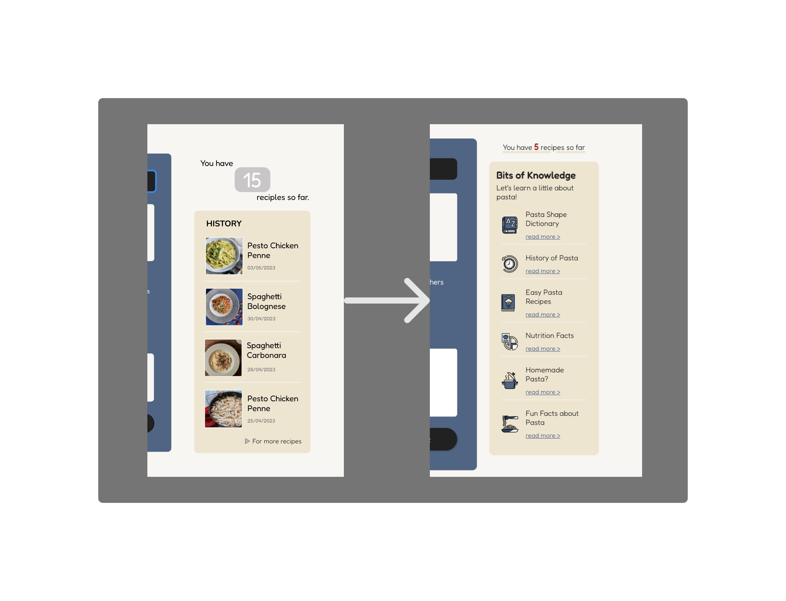
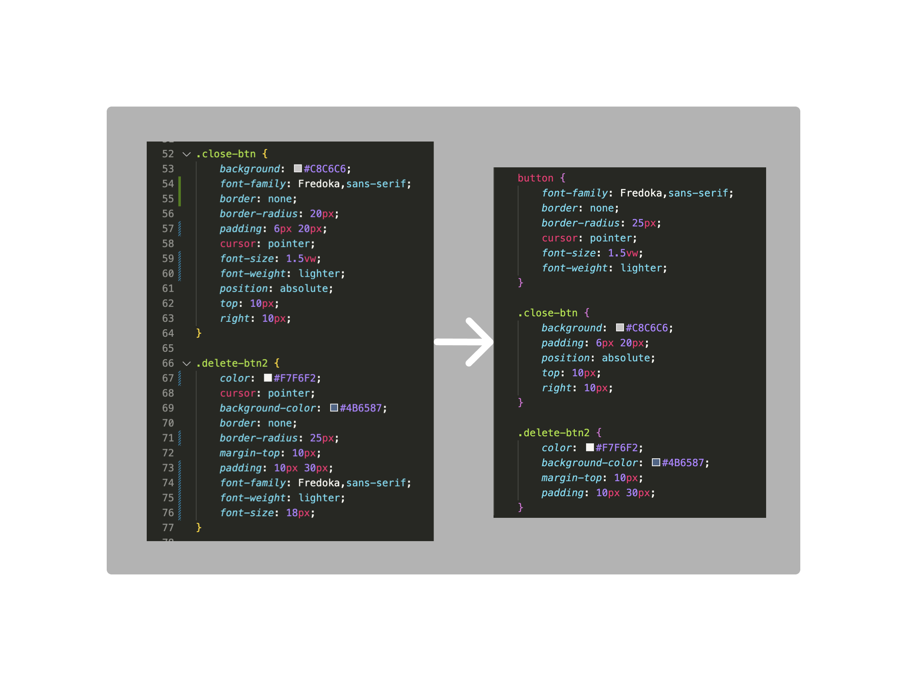

# DECO2017 A4 - Web Application Prototype
__by Ayari Omachi__


# PASTACIAN

PASTACIAN is like a __pasta diary__. It allows users to keep track of pasta dishes they have enjoyed and organize it for future references, whether it's a homemade creation or a restaurant experience. It has a feature to record the details of each pasta dish, including name, image, type of pasta, type of sauce, etc. The target audience would likely to be any pasta lovers who have a passion for trying different pasta dishes and want to keep some records of it. The user-friendly interface and features make it accessible and easy to navigate and utilize the application by all background of users.

## Table of Content
* [Design](#design)
* [Sample Codes](#sample-codes)
* [From Mockup to Prototype](#from-mockup-to-prototype)
* [Struggle and Improvements](#struggle-and-improvements)
* [Further Extentions](#further-extensions)
* [Reference](#reference)

## Design
### Color Palettes
 `Customized-blue: #4B6587`

 `Customized-cream: #F0E5CF`

 `Customized-white: #F7F6F2`

 `Customized-gray: #C8C6C6`

#### Accessibility

Using [__Contrast Checker__](https://webaim.org/resources/contrastchecker/) from __WebAIM__ to check that the website is accessible to anyone.
There are two major combinations of colors that are used in the website. According to the Contrast Checker, these color are considered accessible to almost all users in terms of the colors.

### Fonts
* Italiana: the title of the page
* Cute Font: header, section/div titles
* Nunito: all others(descriptions, mini titles, etc.)

## Sample Codes
### __Javascript__
<ins>Displaying a random image every time users reload</ins><br>
In the mockup, I was planning on displaying a random image from the list(meaning what users have uploaded). However, I realized how complicated and difficult it would be and changed to a new plan where I make use of Unsplash's amazing feature. I started from getting my own Client ID and learning from online resources, and finally was able to create what I was hoping to see. The only downside is that although I gave a specific search term, it is still a random selection, and therefore, it sometimes display a photo that is not 'pasta'.

```Javascript
const clientID = "FJCiQHf7dxnNHq5FIatk85sy6neYzJeEvXiX_KbXlOU";
const endpoint = `https://api.unsplash.com/photos/random/?query=pasta&orientation=landscape&client_id=${clientID}`;

const imageElement = document.querySelector("#unsplashImage");

fetch(endpoint)
  .then((response) => response.json())
  .then((jsonData) => {
    imageElement.src = jsonData.urls.regular;
  })
  .catch((error) => {
    console.log("Error: " + error);
  });
```

<ins>InnerHTML</ins><br>
Using InnerHTML helped me in terms of simplicity and flexibility. I was able to control and update the content very easily without having to look for certain elements in HTML or even CSS.
```Javascript
   // Create the content of the popup
    const content = document.createElement("div");
    content.classList.add("popup-content");
    content.innerHTML = `
      <button class="close-btn">Close</button>
      <h2>${item.name}</h2>
      
      <p><strong>Date:</strong> ${item.date}</p>
      <p><strong>Type of Sauce:</strong> ${item.sauce}</p>
      <p><strong>Type of Pasta:</strong> ${item.pastaType}</p>
      <p><strong>Notes:</strong></br> ${item.notes}</p>
      <button class="delete-btn2">Delete from the list</button>
    `;
```

### __CSS__
<ins>Responsive Design</ins><br>
Here is an example of how I created a web application that is responsive to both web and mobile. In this example, I changed the number of column in the grid in the item list, so that users can properly see images and read texts associated to item. As the width of the device gets smaller, the number of column and the size of the item box gets bigger.
```CSS
@media screen and (max-width: 600px) {
    .item-list {
        grid-template-columns: repeat(2,1fr);

        li p {
            font-size: 3vw;
        }
    }
}

@media screen and (max-width: 400px) {
    .item-list {
        grid-template-columns: repeat(1,1fr);
    }
}
```


## From Mockup to Prototype

### __Header__
Starting from the nav bar, the list of links for two reasons. One is because there were only <ins>two</ins> pages where users can jump between pages(which includes home where they start), and I thought that there is no much of use. Another reason is that I decided to only have one sigle page in this web application. I realized that the users will need to click a link and jump to another page just to look at their list of items and it would same so much time and effort if I just get rid of it. (So basically for simplicity and efficiency!)

Now, there is a text "Scroll down to your list" to be clicked and literally, it will bring the users to the section right away. I was torn between "List" to keep it simple, but I decided to speicify it so that users know it's a scroll down and not a jump to new page.


### __Sidebar__
This is the part where bigger changes were made. As mentioned above, the list of items section is moved at the bottom of the page, and this meant that the small history page was no longer necessary. I thought about it for a while and decided to add a little new section to where users can learn about pasta. The content varies from history to nutrition and quick recipes, and I believe that it was a good decision because these just leads to external websites, meaning it would not require much effort. For visuals, it looked very gloomy with having only texts, so I added some icons that represent each division.

With regards to the top part, I struggled not being able to think of visually appealing design(even in the mockup stage). I tried different ways to amke the number stand out, and after all, I achieved it by simply making it bold and changing color to red.


## Struggle and Improvements
There were many parts where I could not finally figure out what the problems are with my codes, even after looking up on the Internet. At the same time, I had a lot of regrets doing which I realized as I move forward.

1. <ins>Displaying dummy images</ins> <br>
I deicided to include dummy items, so that users know how the listing looks like when they first open the web page. I tried modifying different parts of the codes, but it seems to have the right paths and codes.
2. <ins>Margin and Padding</ins><br>
At the beginning I did not know how I could differenciate between these two
3. <ins>Using vw and not %</ins><br>
This is something I completely forgot that I did in my "Introduction to Web Design" assignment, but then realized in the very end when I was working with responsive. Since I always liked taking Web-first approach than Mobile-first approach, it was a struggle when I realized how much adjustment I had to make with font-size, layout, and the other styles. Because there were too much that I had to change, I only changed the units for font-size and margin/padding where vw would help reduce the work. 
4. <ins>Organizing SCSS</ins><br>
There are quite a lot of files within SCSS folder, and although I separated into the total of 7 files by using importing method, it was really hard to find all the elements were when polishing things up. The major problems were that, for some parts, I did not arrange them in order and put things together which made the codes extra long. <br>
Below is an example. I had two buttons in the same section and they had some common styling features, but I had them separately. I organized them afterwards and it is much easier to read.



## Further Extensions
This web application still has huge potential to be extended both functionally and visually. 
* Search bar where users can look for a specific term to look for a speicific item. As the number of item increases, it will be hard to track what's in the list, but the current version of this web application does not really take that into consideration. 
* Adding onto the above, we could even have a category for ingredients in the form, so that users can look for recipes with a speicific ingredients they want to use. I debated about this at mockup stage; however, decided to stay with having a "notes" feature(where there is a black textarea) so that users can use it accoding to their needs.
* Filtering and sorting out items. It's very common for web application to have a feature where users can sort items, for example, by "new to old" and "old to new". If we had this, we may also implement a system where users can add recipes to their favorites and keep track of their most favorites recipe for future references.

## Author
Ayari Omachi
unikey: aoma3382

- - - -
## Reference for Readme <br>
* Adding color to a README: https://github.com/bengourley/placeholder/blob/master/Readme.md
* Contrast check: https://webaim.org/resources/contrastchecker/
